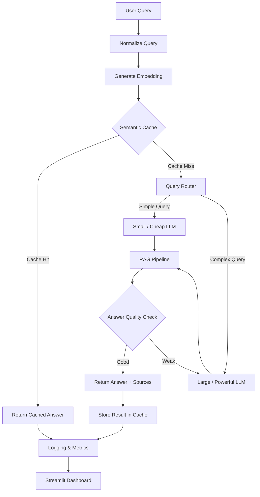

# 🚀 Cost-Aware RAG with Semantic Caching

An optimized **Retrieval-Augmented Generation (RAG)** system that reduces LLM costs and latency by combining **semantic caching** with **cost-aware model routing**.

Instead of sending every query to a large and expensive LLM, the system:

* Reuses answers for semantically similar queries.
* Routes simple queries to a smaller/cheaper model.
* Routes complex queries to a larger model.
* Escalates to the larger model when the initial answer is not reliable.
* Tracks cost, latency, cache hits, and answer quality.

## 🏗️ Architecture

## 🔄 How It Works

1. **User submits a question.**
2. The query is normalized and converted into an embedding.
3. The system checks the **semantic cache** for a similar previous query.
4. If a valid cache match exists, the stored answer is returned immediately.
5. If there is no cache hit, the **query router** determines whether the question is simple or complex.
6. Simple queries use a smaller, cheaper LLM, while complex queries use a larger LLM.
7. The RAG pipeline retrieves relevant documents and generates an answer with sources.
8. If the small model produces a weak answer, the query is **escalated** to the large model.
9. Results and performance metrics are logged and displayed on a dashboard.

## 🛠️ Tech Stack

* **Python**
* **FastAPI** — API service
* **Qdrant / Redis** — Semantic cache & vector search
* **Sentence Transformers** — Embeddings
* **LiteLLM** — Multiple LLM providers/models
* **SQLite / PostgreSQL** — Request logs
* **Streamlit** — Monitoring dashboard

## 📊 Evaluation

The system is evaluated against a baseline RAG system using:

* Cache Hit Rate
* Cost per Request
* p50 / p95 Latency
* Answer Quality
* Cost Reduction
* Quality Difference

The goal is to **reduce cost and latency while maintaining answer quality**.

## 🎯 Project Goal

> Build an efficient production-style RAG system that intelligently balances **cost, latency, and answer quality** instead of using the same expensive LLM for every query.

## 📌 Future Improvements

* User/tenant-aware caching
* Better LLM-based query routing
* Advanced evaluation metrics
* Authentication
* Cloud deployment
* GraphRAG integration
